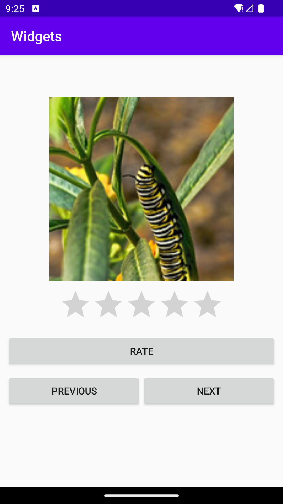

# Rapport

För min layout så valdes constraint-layout där en Imageview, Ratingbar och 3st Buttons lades till. 
Imageview lades till och fick en constraint från dess topp till parent och fick sedan en width som
sattes till match_parent för att sträcka ut bilden till hela bredden. Den fick även constraint till 
bredden för Start och End av ImageView.
```
...
        android:layout_marginStart="10dp"
        android:layout_marginLeft="10dp"
        android:layout_marginTop="60dp"
        android:layout_marginEnd="10dp"
        android:layout_marginRight="10dp"
        android:contentDescription="Image of a larv"
        app:layout_constraintEnd_toEndOf="parent"
        app:layout_constraintStart_toStartOf="parent"
        app:layout_constraintTop_toTopOf="parent"
...
```
Sedan lades en RatingBar in under ImageView och toppen av RatingBar fick en constraint till botten 
av ImageView för att förhålla sig till dess position och fick en margin på 10dp för att få lite 
mellanrum däremellan. 
```
   <RatingBar
        android:id="@+id/ratingBar2"
        android:layout_width="wrap_content"
        android:layout_height="wrap_content"
        android:contentDescription="Stars for rate the image"
        app:layout_constraintStart_toStartOf="parent"
        app:layout_constraintEnd_toEndOf="parent"
        app:layout_constraintTop_toBottomOf="@id/imageView"
        android:layout_marginTop="10dp"
   />
```
För de tre knapparna så gjordes den ena knappen för att täcka hela bredden av skärmen och då sattes 
dess bredd till 0dp och fick sedan en margin på Start och End på 10dp för att inte hamna för långt 
ut. Den fick en constraint till ratingbar som ligger över för att förhålla sig till den och en margin
 på 10dp för att få lite mellanrum. 
```
        android:id="@+id/button3"
        android:layout_width="0dp"
        android:layout_height="wrap_content"
        android:text="Rate"
        app:layout_constraintTop_toBottomOf="@id/ratingBar2"
        app:layout_constraintEnd_toEndOf="parent"
        app:layout_constraintStart_toStartOf="parent"
```
De andra två knapparna skulle ligga bredvid varandra och fick en constraint mellan sig och ut från 
Start respektive End ut mot parent för att knapparna skulle förhålla sig till kanterna på skärmen. 
Då sattes även bredden för knapparna på 0dp för att sträcka ut och fördela sig över hela skärmen.
Kodexempel på den ena knappen nedan.
```
    <Button
        android:id="@+id/button2"
        android:layout_width="0dp"
        android:layout_height="wrap_content"
        android:layout_marginTop="10dp"
        android:layout_marginRight="10dp"
        android:text="Next"
        app:layout_constraintEnd_toEndOf="parent"
        app:layout_constraintStart_toEndOf="@id/button"
        app:layout_constraintTop_toBottomOf="@id/button3"
        android:layout_marginEnd="10dp" />
```



Bild på applikationen.

